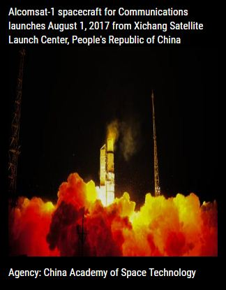
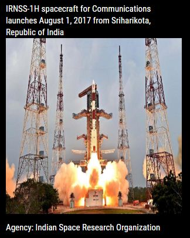
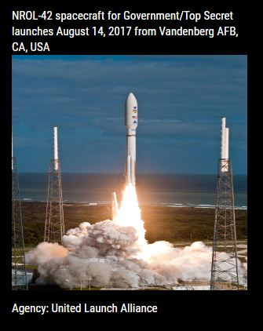
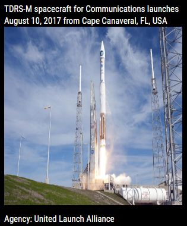

## MMM-Launch

* Ever wonder just how often mankind is launching things into space? Once a year? Twice?

* **Wrong!** On a daily basis. Often, several times a day! Don't believe it? Neither did I. 

## How it works

Every 30 seconds, MMM-Launch will tell you the upcoming dates, launch sites, 
the spacecraft, who is launching, the missions, the agencies responsible for 
each launch, pictures of the spacecraft and a full description of each mission.  

## Examples

* Pictures without full description. Config option.

, ,

, ,

* Annotated .css file included for aligning and coloring text and image sizing.

## Installation

* `git clone https://github.com/mykle1/MMM-Launch` into the `~/MagicMirror/modules` directory.

* No API key needed! No dependenices needed! No kidding!

## Config.js entry and options

    {
        module: 'MMM-Launch',
        position: 'top_left',               // Best in left or right region
        config: {
			showPix: "Yes",                 // No = No picture
			showAgency: "Yes",              // No = Launch Agency not shown
			showDescription: "No",          // Yes = full description of mission under picture
			useHeader: false,               // false if you don't want a header
			header: "We have liftoff!",     // Any text you want. useHeader must be true
			maxWidth: "300px",
        }
    },
	
## NFW? Do you believe me now?
